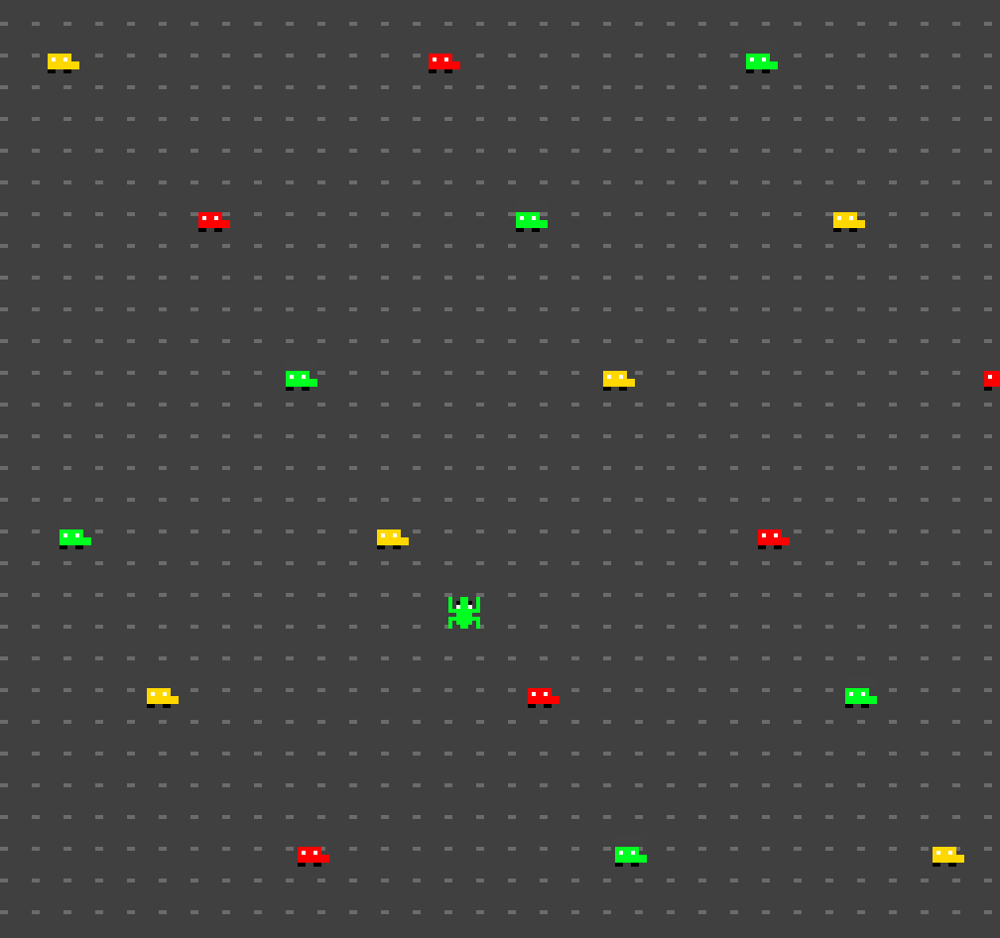

# Stoplight Froggo

Author: Sarah Pethani

Design: Frogger, but with a color twist! Get your frog to the end of the road, knowing that cars the same color as you cannot hurt you; but beware, your frog changes color!

Screen Shot:

How Your Asset Pipeline Works:

I created 8 x 8 .png images using paint.net for each sprite in my game. Then, in a text file labeled [sprites.txt](./dist/data/sprites.txt), I note the file names, whether the sprite is in the foreground or background, the number of sprites to be generated from the file, and finally an index into the palette. The [palette](./dist/data/palette.png) was created as a 4 x 8 .png image, where each row represents a color palette. My code in `generate_ppu` then reads the sprites.txt file to generate tiles and sprites for the ppu accordingly, by matching the colors in the tile to the colors in the provided row of the palette. 

For the background, I drew a 8 x 8 .png image intended to be repeated for the background image. The code in `generate_ppu` sets every index in `ppu.background` to have the same tile to achieve this effect.

The files I drew:
- [background](./dist/data/background.png)
- [green car](./dist/data/green_car.png)
- [green frog](./dist/data/green_frog.png)
- [yellow car](./dist/data/yellow_car.png)
- [yellow frog](./dist/data/yellow_frog.png)
- [red car](./dist/data/red_car.png)
- [red frog](./dist/data/red_frog.png)
- [palette](./dist/data/palette.png)

How To Play:

Use the up/down/left/right arrow keys to move your frog. 
Get your frog to the other side of the road by navigating to the top of the screen.

Try not to be hit by cars, as they'll return you to the starting point! Luckily, cars the same color as our froggo will not hit us.
Utilize the fact that froggo is immune to cars of the same color, as our froggo changes colors every few seconds!

The console will print "You Win!" when you successfully reach the other side.

This game was built with [NEST](NEST.md).

